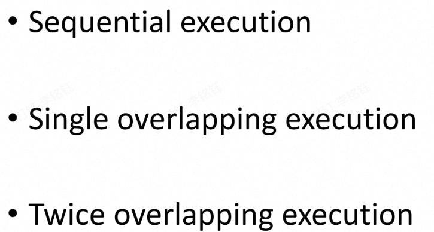
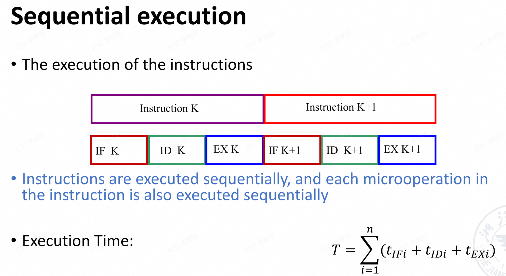
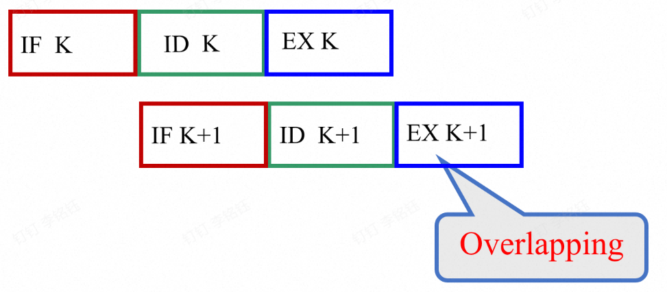
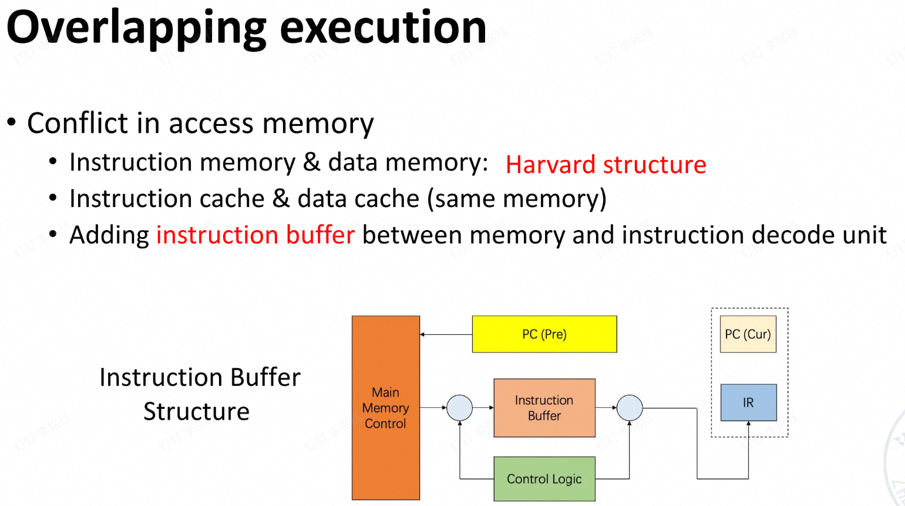
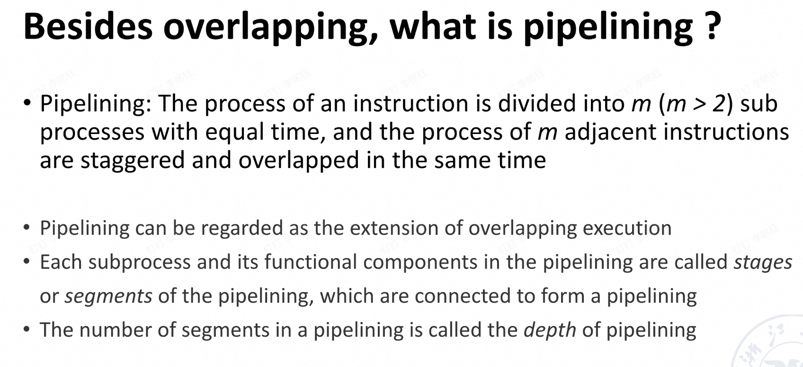

# 知识补充
## Goals of ISA design 
- 兼容性(Compatibility)[在不同类型的电脑上都可以使用]
- 多样性(Versatility)[可以进行多种操作，加减乘除查询等内容]
- 高效率(High efficiency)
- 安全性(Security)
## ISA Classification Basis
The types of storage:
- stack
- GPR:
  > register-memory
  > register-register
  > memory-memory
- Accumulator(累加器)
## Addressing Modes
- immediate
- PC
- 基地址寻指
- register
## 翻译结果

# Pipelining
## Q1：什么是流水线
流程：排队，进行活动，确认结束。目的是加速整体的进行，从个人的角度来说会有等待的时间，但是对于整体来说时间会比较少，进行的比较快。
#### Laundry Example
流程：洗衣服，烘干，折叠。洗30min，烘40min，折叠20min.
4个人进行操作的话，如果是单周期，4*1.5h=6h。如果按照流水线的话，30+40+40+40+40+20=210min=3.5h
### 流水线实行的条件
1. 一个任务有多个阶段
2. 阶段之间有依赖关系
3. 同一个阶段中可以进行多个任务
4. 时间最长的那个阶段决定了结束时间
### 加速指令执行的方法
1. 缩短每一条指令的时间
2. 减少整体的运行时间
### 依赖关系
ADD X5,X6,X7
X6,X7可以并行，但是X5是和6,X7有依赖关系的
## Q2:Three modes of execution

- Sequential Execution

- Overlapping Execution

每一次运行有k个小部分。这个是多重叠的。
一共N次运行，在全部都进入之前是第一个阶段，全部进入是第二个阶段，第三个阶段和第一个阶段总体差不多，就是选择哪个阶段的时间进行分析。
第一个阶段就是每一个小块选最大时间，一共k-1个。全部进入是所有阶段中的最大的有N+1-k个，最后的一个阶段和第一个阶段的时间计算相同。
此外还有单重叠的形式，不会出现等待或冲突的情况。等到每一步的最后一个部分才会有重叠
双重叠，重叠两个

### 重叠运行对存储器的修改

这时可以同时进行操作和取指，有了可以存储的buffer
## 流水线不等同于重叠执行，流水线中存在可能出现冲突的情况，还有如何解决冲突的问题
